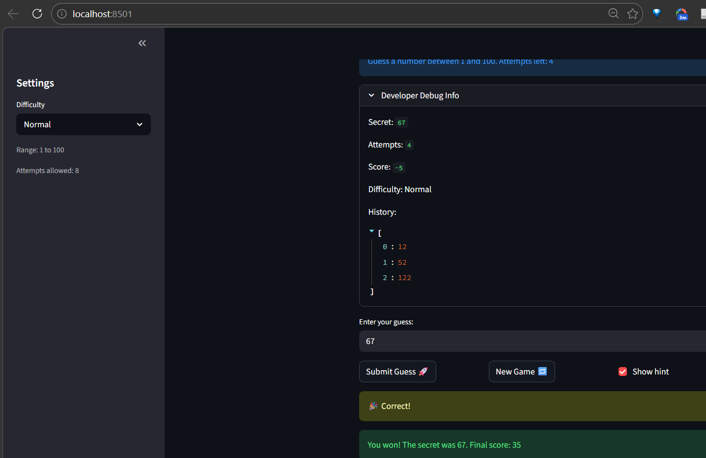

# Capstone = Game Glitch Investigator: The Impossible Guesser

## 🚨 The Situation

You asked an AI to build a simple "Number Guessing Game" using Streamlit.
It wrote the code, ran away, and now the game is unplayable. 

- You can't win.
- The hints lie to you.
- The secret number seems to have commitment issues.

## ✅ Project Evolution

**Phase 1: Debug & Fix** ✓
- Fixed state management bugs
- Corrected hint logic
- Moved logic into `logic_utils.py`
- All tests passing

**Phase 2: Object-Oriented Refactor** ✓
- Introduced `Game`, `GameConfig`, and `GameState` classes
- Improved code maintainability and extensibility
- Maintained backwards compatibility
- Ready for advanced features (multiplayer, achievements, leaderboards)

## 🛠️ Setup

1. Install dependencies: `pip install -r requirements.txt`
2. Run the app: `python -m streamlit run app.py`

## 📚 Architecture

### Core Classes (in `logic_utils.py`)

**`GameConfig`** - Configuration management
```python
config = GameConfig("Normal")
low, high = config.get_range()           # (1, 100)
attempt_limit = config.get_attempt_limit()  # 8
```

**`GameState`** - Game data holder
```python
state = GameState(
    secret=42,
    attempts=0,
    score=0,
    history=[],
    status="playing"
)
```

**`Game`** - Main game logic
```python
game = Game(config=config, state=state)
success, outcome, message = game.process_guess("50")  # Complete turn
```

### Backwards Compatibility

Original utility functions still available:
- `get_range_for_difficulty(difficulty: str)`
- `parse_guess(raw: str)`
- `check_guess(guess: int, secret: int)`
- `update_score(current_score: int, outcome: str, attempt_number: int)`

## 🕵️‍♂️ Gameplay

1. **Play the game** - Open the Streamlit app and try to guess the secret number
2. **Debug mode** - Check the "Developer Debug Info" tab to see the secret (for testing)
3. **Difficulty levels** - Choose Easy, Normal, or Hard from the sidebar
4. **Score tracking** - Earn points based on your guesses and performance

## 🧪 Testing

Run all tests:
```bash
pytest tests/test_game_logic.py -v
```

All tests passing ✓

## 📝 Code Quality

- ✅ Type hints throughout
- ✅ Dataclass-based state management
- ✅ Encapsulated game logic
- ✅ Clean separation of concerns
- ✅ Backwards compatible

## 📸 Demo

- [.] [Insert a screenshot of your fixed, winning game here]


## 🚀 Stretch Features for Enhancement

- [ ] **Multiplayer Mode** - Track multiple players and create a leaderboard
- [ ] **Game Modes** - Add "Code Breaker", "Speed Mode", or "AI Opponent" modes
- [ ] **Achievement System** - Unlock badges for milestones
- [ ] **Persistent Storage** - Save player profiles and game history
- [ ] **Analytics Dashboard** - Display player statistics and trends
- [ ] **Backend API** - Separate Streamlit frontend from FastAPI backend
- [ ] **Enhanced UI** - Dark theme, animations, accessibility features

